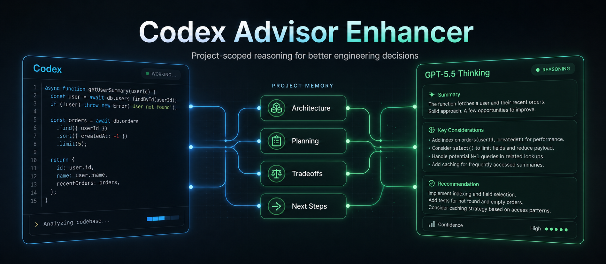

# Codex ChatGPT Advisor Enhancer



Give Codex a project-scoped reasoning advisor for the moments where raw coding ability is not enough.

Codex is excellent at reading files, editing code, running tests, and debugging. But many real engineering decisions are not just code edits. They are architecture calls, tradeoffs, planning decisions, model choices, deployment strategy, and "what should I do next?" questions.

This repo prototypes a simple idea:

```text
Codex handles execution.
GPT-5.5 Thinking acts as a second-pass advisor.
Each project keeps its own advisor memory.
Hard tasks can escalate into a small advisor conclave.
```

The result is a Codex workflow that feels sharper on high-impact decisions without slowing down routine implementation work.

## Why This Matters

Most coding-agent failures do not happen because the agent cannot type code. They happen because the agent confidently chooses the wrong direction, misses a constraint, overbuilds, underplans, or fails to compare tradeoffs.

The `external-advisor` skill helps with that layer.

It is designed for questions like:

- Which architecture should I choose?
- What should I build next?
- Is this model/tool/strategy a good direction?
- What are the risks before I deploy or demo this?
- What am I missing in this plan?
- Should I simplify, scale, refactor, or wait?

It is intentionally not meant for every small bug fix. Codex should still handle normal coding/debugging directly.

## What It Does

- Installs a Codex skill named `external-advisor`.
- Starts a local OpenAI-compatible `g4f` API.
- Uses `gpt-5-5-thinking` by default with high reasoning effort.
- Persists one advisor conversation per working directory.
- Syncs the online ChatGPT advisor chat before and after each persistent advisor call.
- Writes local transcript files Codex can inspect later.
- Adds optional conclave mode with role-specific planner, critic, security, verifier, and synthesis advisors.
- Adds an advisor router for no-advisor, single-advisor, conclave, verifier, and machine-json verifier paths.
- Adds critique-before-final mode for important answers.
- Adds a verifier loop that asks what evidence to gather, runs safe local commands, then asks the verifier to interpret the actual output.
- Lets you explicitly say `Use the external advisor` when you want a second opinion.

Project-local memory looks like this:

```text
your-project/
  .codex-advisor/
    conversation.json   # continuation state
    transcript.json     # synced structured transcript
    transcript.md       # readable synced transcript
    roles/              # optional conclave role memories
    conclave-runs/      # saved multi-advisor runs
    verifier-runs/      # saved evidence-backed verifier loops
    latest-conclave.md  # latest conclave synthesis
    latest-verifier-loop.md
```

That means:

```text
Codex session for project A <-> ChatGPT advisor chat for project A
Codex session for project B <-> ChatGPT advisor chat for project B
```

You can even write in the same ChatGPT advisor chat online, and the next Codex advisor call will sync that conversation back into the local transcript.

## The Big Idea For Codex

This repository is a prototype, not the ideal production design.

The valuable part is not `g4f` or HAR files. The valuable part is the workflow:

```text
Project-scoped Codex advisor memory
+ stronger reasoning for judgment-heavy questions
+ automatic use only when it matters
```

An official Codex version could replace the local `g4f`/HAR layer with OpenAI-managed model access, authentication, privacy controls, and project memory. That would make this workflow cleaner, safer, and much more reliable.

## Current Prototype Stack

This repo currently uses:

- Codex skill: `external-advisor`
- Local API: `http://127.0.0.1:8080/v1`
- Provider: `OpenaiAccount`
- Default model: `gpt-5-5-thinking`
- Reasoning effort: `high`
- Backend bridge: `gpt4free`
- Local transcript sync: `.codex-advisor/transcript.md`
- Conclave runner: `codex-skill/external-advisor/scripts/conclave.py`
- Router: `codex-skill/external-advisor/scripts/router.py`
- Context pack builder: `codex-skill/external-advisor/scripts/context_pack.py`
- Critique-before-final: `codex-skill/external-advisor/scripts/critique_final.py`
- Evidence-backed verifier loop: `codex-skill/external-advisor/scripts/verifier_loop.py`
- Searchable memory manager: `codex-skill/external-advisor/scripts/memory_manager.py`
- Deterministic advisor ranking inside `conclave.py`
- Local evaluation harness: `codex-skill/external-advisor/scripts/eval_harness.py`

`gpt4free` is not committed into this repository. The setup scripts download it into:

```text
vendor/gpt4free
```

The HAR file is never included. It is sensitive authentication material and must stay local.

## Quick Start

Clone the repo, then run setup.

### Windows

PowerShell:

```powershell
.\setup.ps1
```

### Ubuntu/Linux

Install prerequisites:

```bash
sudo apt update
sudo apt install -y git python3 python3-pip python3-venv
```

Run setup:

```bash
chmod +x setup.sh start-g4f.sh test-advisor.sh test-conclave.sh test-router.sh test-context-pack.sh test-verifier-loop.sh test-memory.sh test-ranking.sh test-eval-harness.sh
./setup.sh
```

Setup will:

- clone `https://github.com/xtekky/gpt4free` into `vendor/gpt4free`
- install Python dependencies
- apply `patches/gpt4free-advisor.patch`
- install the Codex skill into your Codex skills folder
- write `advisor-config.json` so Codex knows the exact local start script path
- create `vendor/gpt4free/har_and_cookies`

## Add Your HAR

Put your ChatGPT HAR file here:

```text
vendor\gpt4free\har_and_cookies\
```

On Ubuntu/Linux:

```text
vendor/gpt4free/har_and_cookies/
```

Do not commit it. Do not share it. Do not paste it into chats.

## Start The Local API

PowerShell:

```powershell
.\start-g4f.ps1
```

PowerShell requires the `.\` prefix. Running `start-g4f.ps1` without it may fail or open the file as text.

Ubuntu/Linux:

```bash
./start-g4f.sh
```

If `vendor/gpt4free` is missing, the start script will run setup automatically before starting the API.

Default model:

```text
gpt-5-5-thinking
```

Optional Pro test:

```powershell
.\start-g4f.ps1 -Model gpt-5-5-pro
```

```bash
./start-g4f.sh gpt-5-5-pro
```

`gpt-5-5-thinking` has been the most reliable default in testing. `gpt-5-5-pro` can work, but may sometimes return blank or thinking-only API output.

## Test The Advisor

Keep the local API running, then run:

```powershell
.\test-advisor.ps1
```

```bash
./test-advisor.sh
```

Expected behavior: the advisor returns a short `ADVISOR_SETUP_OK` response.

## Test The Conclave

Conclave mode is for harder judgment tasks. It asks several bounded advisor roles instead of one generic advisor.

Keep the local API running, then run:

```powershell
.\test-conclave.ps1
```

```bash
./test-conclave.sh
```

Expected behavior: the planner and critic roles answer, and a run is saved under:

```text
.codex-advisor/conclave-runs/
```

By default, conclave roles return readable Markdown/prose so the online ChatGPT advisor chats stay useful to read. Use machine JSON only when Codex needs strict parsing or validation.

## Test The Router And Verifier Loop

These tests do not require a live advisor endpoint:

```powershell
.\test-router.ps1
.\test-context-pack.ps1
.\test-verifier-loop.ps1
.\test-memory.ps1
.\test-ranking.ps1
.\test-eval-harness.ps1
```

```bash
./test-router.sh
./test-context-pack.sh
./test-verifier-loop.sh
./test-memory.sh
./test-ranking.sh
./test-eval-harness.sh
```

The router test confirms task types map to the intended advisor path. The context-pack test creates `.codex-advisor/latest-context-pack.json`. The verifier-loop dry run creates `.codex-advisor/latest-verifier-loop.json` and runs a harmless local command as evidence. The memory test initializes searchable memory and records a sample decision/outcome. The ranking test confirms conclave JSON includes role rankings. The eval harness test confirms the benchmark structure.

## Use From Codex

After setup, restart Codex so it discovers the skill.

You can force it:

```text
Use the external advisor for this answer.
```

The skill is also designed to trigger automatically for broad judgment questions, for example:

```text
I am not sure which direction to take. Can you advise me on the best approach and tradeoffs?
```

Codex should use the advisor for:

- architecture decisions
- what-to-do-next planning
- strategy and roadmap questions
- tool/model selection
- tradeoff analysis
- design direction
- high-impact recommendations

Codex should use conclave mode for:

- architecture decisions that should be challenged
- strategy/model/tool choices with several plausible paths
- security/privacy-sensitive plans
- important plans where a critic should attack Codex's first direction
- complex code review or high-risk changes that need verifier thinking

Codex can route automatically with:

```powershell
python .\codex-skill\external-advisor\scripts\router.py --prompt "Which architecture should this project use?"
```

For failed tests or verification-heavy work, the router points to `verifier_loop.py`, so the flow becomes:

```text
draft/patch -> verifier checklist -> local commands -> verifier interprets output -> Codex decides
```

When `router.py --execute` calls an advisor path, it automatically builds a compact context pack unless `--no-context-pack` is passed.

Codex should skip the advisor for:

- routine code edits
- direct debugging
- simple terminal answers
- low-risk implementation work

## Memory Sync

For one persistent advisor chat per project, do not set `ADVISOR_CONVERSATION_KEY`.

## ChatGPT Project Binding

Advisor calls can bind a repo to a ChatGPT Project so chats created from that repo appear under the same Project on `chatgpt.com`.

By default, when the advisor runs from a repo with no `.codex-advisor/project.json`, it will:

1. derive a Project name from the nearest Git repo or current folder
2. create a private ChatGPT Project through the local HAR-backed session
3. save the returned `g-p-...` id in `.codex-advisor/project.json`
4. route future advisor, critic, conclave, and verifier chats into that Project

This is best-effort. If ChatGPT changes the private endpoint, the advisor skips Project creation and still answers normally.

Disable automatic Project creation:

```powershell
$env:ADVISOR_AUTO_CREATE_PROJECT = "false"
```

```bash
export ADVISOR_AUTO_CREATE_PROJECT=false
```

Manually create and bind a private Project:

```powershell
python .\codex-skill\external-advisor\scripts\project_bind.py --create --name "my-project"
```

```bash
python3 ./codex-skill/external-advisor/scripts/project_bind.py --create --name "my-project"
```

Or manually bind an existing ChatGPT Project:

```powershell
python .\codex-skill\external-advisor\scripts\project_bind.py --url "https://chatgpt.com/g/g-p-.../project" --name "my-project"
```

```bash
python3 ./codex-skill/external-advisor/scripts/project_bind.py --url "https://chatgpt.com/g/g-p-.../project" --name "my-project"
```

This writes:

```text
.codex-advisor/project.json
```

When a project binding exists, normal advisor calls pass the normalized `g-p-...` id to g4f and store the default local conversation state under:

```text
.codex-advisor/projects/<g-p-id>/conversation.json
.codex-advisor/projects/<g-p-id>/transcript.json
.codex-advisor/projects/<g-p-id>/transcript.md
```

You can also set it for one shell session without writing it manually:

```powershell
$env:ADVISOR_CHATGPT_PROJECT_URL = "https://chatgpt.com/g/g-p-.../project"
```

```bash
export ADVISOR_CHATGPT_PROJECT_URL="https://chatgpt.com/g/g-p-.../project"
```

Remove the binding with:

```powershell
python .\codex-skill\external-advisor\scripts\project_bind.py --clear
```

ChatGPT Project support depends on the local g4f patch in this repo. If advisor calls work but Project placement does not, rerun setup and restart `start-g4f`.

Already-running Codex sessions only pick up this upgrade after they restart or reload the installed skill. Repos that already have `.codex-advisor/project.json` keep using the existing Project instead of creating a new one.

The default behavior is:

```text
Before advisor call:
  sync latest online ChatGPT conversation
  update local transcript

Advisor call:
  send the new question

After advisor call:
  save continuation state
  sync transcript again
```

Files written locally:

```text
.codex-advisor\conversation.json
.codex-advisor\transcript.json
.codex-advisor\transcript.md
```

When ChatGPT Project binding is enabled, those files move under `.codex-advisor\projects\<g-p-id>\`.

## Searchable Advisor Memory

The transcript is useful, but full chat history is noisy. Searchable memory keeps compact summaries Codex can inspect quickly.

Initialize memory:

```powershell
python .\codex-skill\external-advisor\scripts\memory_manager.py init
```

```bash
python3 ./codex-skill/external-advisor/scripts/memory_manager.py init
```

Files created:

```text
.codex-advisor/project-profile.md
.codex-advisor/decisions.json
.codex-advisor/advisor-lessons.md
.codex-advisor/open-questions.md
.codex-advisor/outcomes.json
.codex-advisor/memory-summary.md
```

Record an outcome:

```powershell
python .\codex-skill\external-advisor\scripts\memory_manager.py record-outcome --task "Architecture decision" --advisor-mode "conclave" --accepted-advice "Keep role memories separate" --outcome "Implemented and tests passed" --useful true --status accepted --confidence 0.8
```

Record a decision:

```powershell
python .\codex-skill\external-advisor\scripts\memory_manager.py record-decision --decision "Use verifier_loop.py for failed tests" --source "codex" --confidence 0.9 --status accepted
```

Decision memory includes source, confidence, accepted/rejected/superseded status, contradictions, superseded decision links, and age in summaries. This keeps stale advisor advice from silently becoming permanent truth.

## Evaluation Harness

The harness creates a small local benchmark with:

- 10 architecture questions
- 10 code-review tasks
- 10 debugging tasks
- 10 model/tool choice questions

It compares these lanes:

```text
Codex only
Codex + single advisor
Codex + conclave
Codex + critic/verifier
```

Dry-run the structure:

```powershell
python .\codex-skill\external-advisor\scripts\eval_harness.py --dry-run --limit-per-category 1 --strategy all
```

```bash
python3 ./codex-skill/external-advisor/scripts/eval_harness.py --dry-run --limit-per-category 1 --strategy all
```

Live advisor lanes require the local API to be running. The script records latency and output size automatically. Quality scores and Codex-only answers still require manual review because this repo cannot honestly automate Codex itself.

Files written:

```text
.codex-advisor/evaluations/
.codex-advisor/latest-evaluation.json
.codex-advisor/latest-evaluation.md
```

## Conclave Mode

The normal advisor path is:

```text
Codex -> one persistent advisor chat -> Codex final answer
```

Conclave mode is:

```text
Codex -> planner / critic / security / verifier advisors -> synthesizer -> Codex final answer
```

Codex stays in control. The advisors do not edit files or make final decisions. They produce bounded critique, alternatives, risks, and verification ideas.

Run it directly:

```powershell
python .\codex-skill\external-advisor\scripts\conclave.py --mode architecture --prompt "Should this project use one advisor chat or role-specific advisor memory?"
```

```bash
python3 ./codex-skill/external-advisor/scripts/conclave.py --mode architecture --prompt "Should this project use one advisor chat or role-specific advisor memory?"
```

Available modes:

```text
general
architecture
strategy
code-review
security
model-choice
verification
```

`verification` mode asks the verifier role what commands, checks, edge cases, and evidence would prove or reject a recommendation. It is useful after Codex drafts a plan or patch.

Each role gets its own project-local memory:

```text
.codex-advisor/
  roles/
    planner/text/conversation.json
    planner/json/conversation.json
    critic/text/conversation.json
    critic/json/conversation.json
    verifier/text/conversation.json
    verifier/json/conversation.json
  conclave-runs/
  latest-conclave.md
```

Text and JSON role memories are intentionally separated so machine-format runs do not make the online readable ChatGPT chats awkward to use.

By default, role calls run serially because browser-backed ChatGPT bridges can be fragile under concurrent calls. Add `--parallel` only after the local endpoint proves it can handle concurrency reliably.

Conclave uses readable text by default. For machine parsing, validation, or internal automation, request JSON explicitly:

```powershell
python .\codex-skill\external-advisor\scripts\conclave.py --mode verification --machine-json --prompt "..."
```

Machine JSON uses this shape:

```json
{
  "recommendation": "...",
  "confidence": 0.8,
  "risks": [],
  "evidence": [],
  "next_actions": [],
  "verification": {
    "commands": [],
    "checks": [],
    "expected_signals": []
  },
  "escalate": false
}
```

Equivalent explicit form:

```powershell
python .\codex-skill\external-advisor\scripts\conclave.py --mode verification --output-format json --prompt "..."
```

Validate the latest structured conclave run:

```powershell
python .\codex-skill\external-advisor\scripts\validate_conclave.py
```

```bash
python3 ./codex-skill/external-advisor/scripts/validate_conclave.py
```

Saved conclave JSON includes a deterministic `ranking` object. It compares advisor outputs by confidence, evidence count, risk severity, actionability, and user-intent conflict signals. This gives Codex a concrete ranking layer before it decides which advice to accept.

## Critique Before Final

For important answers, Codex can draft first and ask only the critic role to attack the draft:

```powershell
python .\codex-skill\external-advisor\scripts\critique_final.py --prompt "Original user request" --draft "Draft answer to critique"
```

```bash
python3 ./codex-skill/external-advisor/scripts/critique_final.py --prompt "Original user request" --draft "Draft answer to critique"
```

This returns critique only. Codex still writes the final answer.

## Context Packs

Context packs are compact advisor inputs. They avoid dumping an entire transcript or unrelated files.

Run one directly:

```powershell
python .\codex-skill\external-advisor\scripts\context_pack.py --prompt "Review this plan" --draft "Current plan..." --file README.md
```

```bash
python3 ./codex-skill/external-advisor/scripts/context_pack.py --prompt "Review this plan" --draft "Current plan..." --file README.md
```

The pack can include:

- task
- current draft or plan
- selected relevant files
- git status, diff stat, diff check, and compact diff
- test failures or error output
- constraints
- existing advisor memory summaries when present

Files written:

```text
.codex-advisor/context-packs/
.codex-advisor/latest-context-pack.json
.codex-advisor/latest-context-pack.md
```

## Verifier Loop

Use the verifier loop when a plan or patch needs evidence:

```powershell
python .\codex-skill\external-advisor\scripts\verifier_loop.py --prompt "Verify this patch" --draft "What changed..." --command "python -m py_compile codex-skill\external-advisor\scripts\verifier_loop.py"
```

```bash
python3 ./codex-skill/external-advisor/scripts/verifier_loop.py --prompt "Verify this patch" --draft "What changed..." --command "python3 -m py_compile codex-skill/external-advisor/scripts/verifier_loop.py"
```

The loop writes:

```text
.codex-advisor/verifier-runs/
.codex-advisor/latest-verifier-loop.json
.codex-advisor/latest-verifier-loop.md
```

By default it runs explicit commands plus safe verifier-suggested commands such as tests, linters, `git status`, and `git diff`. Suspicious shell commands are skipped unless `--allow-unsafe-commands` is used.

To skip remote transcript sync for one call:

```powershell
$env:ADVISOR_SYNC_REMOTE = "false"
```

For multiple separate advisor chats inside the same project:

```powershell
$env:ADVISOR_CONVERSATION_KEY = "my-topic"
```

## Fresh Advisor Chat

Delete:

```text
.codex-advisor\conversation.json
```

or set a different `ADVISOR_CONVERSATION_KEY`.

## Why This Can Improve Codex

This does not make Codex magically smarter at every task. It improves the workflow by adding a second reasoning pass exactly where a second pass matters.

Codex remains the executor:

```text
read repo -> edit files -> run commands -> verify work
```

The advisor improves the decision layer:

```text
architecture -> tradeoffs -> risks -> next steps -> better final answer
```

For complex projects, that separation is powerful. You get fast local execution plus a stronger strategy review before Codex commits to a direction.

## Safety

- This setup depends on your own local HAR/session and `g4f`.
- Do not commit `vendor/gpt4free/har_and_cookies`.
- Do not commit `.codex-advisor`.
- Do not use this to bypass access controls or share private session material.
- Treat advisor output as critique, not ground truth.
- Verify important claims before using them.

## Repository Privacy

Ignored by default:

```text
vendor/
har_and_cookies/
.codex-advisor/
*.har
*.cookie.json
.env
```

The public repo should contain only the skill, scripts, docs, and patch files. Your HAR, cookies, and local advisor transcripts stay on your machine.
